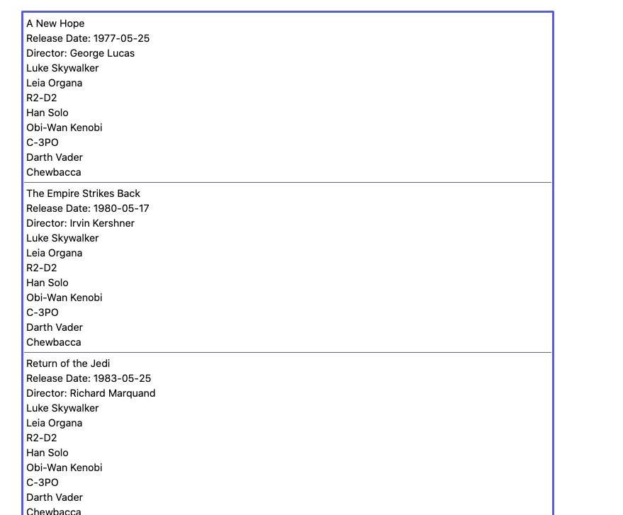

Hello! Thank you for taking the time to work through this case study. We’ve done our best to ensure that it won’t take too much of your time to complete. Please work through all of the tasks and send us back the result.

You are not permitted to share the case study publicly. Please do not upload it to Github. This has been done in the past and we do notice when people copy solutions which are publicly accessible. Many engineers have failed this test because they copied a bad solution from somewhere else. 

If you can’t solve a task, please write down your thoughts on how you would approach the problem. We don’t expect you to know everything! But we do want to understand your thought process and how you approach problems to find solutions. You will find the list of tasks [here](#tasks). There are 5 required tasks and 1 optional task.

You can share your solution by sending us the project export generated by the `yarn bundle` command. This will generate a ZIP file containing the contents of this directory, including any `git` history you might have created. Note: It isn’t required that you use any version control for this assignment!

## Requirements

This application uses Next.js to start a development server. In order for you to be able to run the application, you must have the following installed

- Node.js v12.6.0+
- yarn 

**Note:** All of the following steps can also be performed using npm

## Setup

Download and install dependencies

```
yarn install
```

To build the project for production

```
yarn build
```

And to start the server in production mode

```
yarn start
```

If you want to start the server in development mode, meaning it will rebuild as you work on the project

```
yarn dev
```

To run the included tests

```
yarn test
```

## Brief

We are building a database for the Star Wars cinematic universe and we need to be able to easily view a list of films, as well as the characters for each of those films. Your job is to finish up a few of our outstanding tasks.

### Goal

When this application is finished the user should be able to 

- view a list of films in the Star Wars cinematic universe
- clicking on a film should open a panel, showing the director, the release date, and a list of characters in that film
- clicking on a character should open a modal window that shows details about the character the user selected

For all of the tasks, you are free to adjust, or not adjust, the stylings as you see fit. We have preconfigured the project to use [TailwindCSS](https://tailwindcss.com/) for convenience. 
## Tasks

### WEB-101

Your first task is to finish the `FilmList` component. It currently lists all of the films by title as well as controls whether or not to open a panel. Remember that when a user clicks on a film title, a panel should open showing the director, the release date, and a list of characters in that film. Right now, our panel opens, but it doesn’t show anything.

Please adjust the panel to show the characters related to the film.

### WEB-102

It looks like we have a bug in our `FilmList` implementation. For some reason, selecting a film opens all of the panels at the same time! This is almost correct. All of the panels can be open at once, but we want each panel to open independently from the others. 

Please adjust `FilmList` so that each panel opens independently from the others.

**Note:** Don't worry, the data we are using at this point is just test data, and the characters will be the same for all movies. Your results might look something like this:



### WEB-103
Our `FilmList` component is starting to get a bit long. We should split up those panels into individual components to make the code less verbose.

Please create a component, `FilmListItem` which can be used to display the information we need. There may be some warnings in the console, now would be a good time to fix this as well.

### WEB-104
Now that we can view all of the films and their characters, our PO (product owner) tells us we also need to be able to view details about each character. For this feature, the PO wants the user to be able to click on a characters name and it open a modal window listing the following information

- name
- birth year
- eye color
- gender
- height
- mass
- skin color
- name of their home world

You can create your own modal window, or you can use the basic modal we've made in `@components/modal`. 

Please implement this feature.

### WEB-105
Now that the application is in a good state, we need to connect to real data. One of our engineers already set up the Apollo client to connect to the [SWAPI (Star Wars API) GraphQL Server](https://graphql.org/swapi-graphql) and wrapped the application in an `ApolloProvider` component. We just need to adjust the GraphQL query in `@components/case-study` and use it within `CaseStudy.tsx` to retrieve the information. 

Please replace the hard-coded data with the data that is coming from the SWAPI GraphQL server.

Here are some useful links if you get stuck:

- [Fetching data with Apollo Client](https://www.apollographql.com/docs/react/data/queries/)
- [SWAPI GraphiQL Client](https://graphql.org/swapi-graphql)
- [More information about the Star Wars API](https://swapi.dev/)

### WEB-106 (optional)

The application is finished! However, our PO came to us and said that it would be an interesting idea to be able to search for a film and the list would filter based on the film that was searched for. The PO also said that we need to able to go directly to this filtered list via a URL.

You can accomplish this however you wish, but a general approach we might use is:

1. Create a search form component and mirror its state in the URL
2. Whenever the value of the search form changes filter the data to show the relevant films

Here are some useful links if you get stuck:

- [Dynamic Routing in Next.js](https://nextjs.org/docs/routing/dynamic-routes)
- [Fetching data with Apollo Client](https://www.apollographql.com/docs/react/data/queries)
